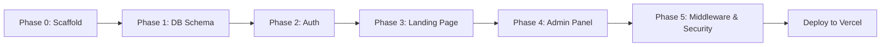

# 🏦 Exchange 286 — Implementation Plan
**Version:** 2.0.0 (Vercel-Native Architecture)
**Date:** 14 May 2026

---

## Tech Stack Summary

| Layer | Technology |
|---|---|
| Framework | Next.js 15 (App Router) |
| Auth | NextAuth.js v5 |
| Database | Vercel Postgres |
| ORM | Drizzle ORM |
| Styling | Tailwind CSS v4 + Shadcn/UI |
| Theme | next-themes (flicker-free) |
| Fonts | Geist Sans + Geist Mono |
| Deployment | Vercel |

---

## Phase 0 — Project Scaffolding

### Commands (run in `exchange 286/` dir)

```bash
# 1. Create Next.js app
npx create-next-app@latest ./ --typescript --tailwind --eslint --app --src-dir --import-alias "@/*" --yes

# 2. Install core dependencies
npm install drizzle-orm @vercel/postgres drizzle-kit
npm install next-auth@beta @auth/drizzle-adapter
npm install next-themes
npm install bcryptjs
npm install @types/bcryptjs -D

# 3. Install Shadcn/UI
npx shadcn@latest init

# 4. Add Shadcn components needed
npx shadcn@latest add button card table badge input label dialog form toast switch skeleton tabs
```

---

## Phase 1 — Database Schema & ORM Setup

### File: `src/db/schema.ts`

```typescript
// exchange_rates   — currency_code, buy_rate, sell_rate, updated_at
// supported_banks  — bank_name, bank_code, logo_url, is_active
// operational_hours — day_of_week (0-6), open_time, close_time, is_closed
// system_settings  — setting_key, setting_value (key-value store)
// users            — email, hashed_password (admin credentials)
```

### Drizzle Config: `drizzle.config.ts`
- Points to `POSTGRES_URL` env var from Vercel
- Migrations in `src/db/migrations/`

---

## Phase 2 — Authentication (NextAuth.js v5)

### Files
- `src/auth.ts` — NextAuth config with Credentials provider
- `src/middleware.ts` — Route protection + rate limiting
- `src/app/admin/login/page.tsx` — Login form UI

### Key Decisions
- Credentials provider with bcrypt password comparison
- Session strategy: `jwt` (optimal for serverless)
- Rate limiting on `/api/auth/signin` via middleware counter in headers
- All `/admin/*` routes protected except `/admin/login`

---

## Phase 3 — Public Landing Page

### Route: `src/app/(public)/page.tsx`

| Section | Component | Data Source |
|---|---|---|
| Announcement Bar | `<MarqueeBar />` | `system_settings.marquee_text` — Server Component |
| Exchange Rates | `<RatesTable />` | `exchange_rates` — ISR revalidate 60s |
| Supported Banks | `<BanksGrid />` | `supported_banks` where `is_active = true` |
| Operational Hours | `<HoursTable />` | `operational_hours` — Server Component |
| Map Button | `<MapButton />` | `system_settings.maps_url` |

### Design Specs
- **Navigation:** Bottom Navigation Bar (mobile-first, no hamburger)
- **Theme toggle:** Placed in top-right header, flicker-free via `next-themes` + `suppressHydrationWarning`
- **Monospace font:** Applied globally to all rate/time values via Geist Mono
- **Color palette:** Deep navy/midnight blue dark mode, clean white light mode, gold/amber accent for rates

---

## Phase 4 — Admin Dashboard

### Routes under `src/app/admin/`

```
admin/
├── login/          → Login page (public)
├── dashboard/      → Overview stats
├── rates/          → CRUD for USD, SAR, THB
├── announcements/  → Marquee text + Maps URL settings
├── banks/          → CRUD for supported banks
└── hours/          → CRUD for operational hours
```

### API Routes under `src/app/api/admin/`

```
api/admin/
├── rates/          → GET, POST, PUT (update by currency_code)
├── banks/          → GET, POST, PUT, DELETE
├── hours/          → GET, POST, PUT
└── settings/       → GET, PUT (key-value pairs)
```

---

## Phase 5 — Middleware & Security

### `src/middleware.ts`
```typescript
// 1. Rate limiting: track req count per IP in edge headers
//    Limit: 60 req/min for API routes, 5 failed logins/min
// 2. Auth guard: protect all /admin/* except /admin/login
//    Using NextAuth v5 auth() middleware
// 3. Redirect logic: unauthenticated → /admin/login
```

---

## File Structure

```
exchange 286/
├── src/
│   ├── app/
│   │   ├── (public)/
│   │   │   ├── layout.tsx        ← Public layout with BottomNav
│   │   │   └── page.tsx          ← Landing page
│   │   ├── admin/
│   │   │   ├── layout.tsx        ← Admin sidebar layout
│   │   │   ├── login/page.tsx
│   │   │   ├── dashboard/page.tsx
│   │   │   ├── rates/page.tsx
│   │   │   ├── announcements/page.tsx
│   │   │   ├── banks/page.tsx
│   │   │   └── hours/page.tsx
│   │   ├── api/
│   │   │   ├── admin/
│   │   │   │   ├── rates/route.ts
│   │   │   │   ├── banks/route.ts
│   │   │   │   ├── hours/route.ts
│   │   │   │   └── settings/route.ts
│   │   │   └── auth/[...nextauth]/route.ts
│   │   ├── globals.css
│   │   └── layout.tsx            ← Root layout (ThemeProvider)
│   ├── components/
│   │   ├── public/
│   │   │   ├── MarqueeBar.tsx
│   │   │   ├── RatesTable.tsx
│   │   │   ├── BanksGrid.tsx
│   │   │   ├── HoursTable.tsx
│   │   │   ├── MapButton.tsx
│   │   │   ├── BottomNav.tsx
│   │   │   └── ThemeToggle.tsx
│   │   └── admin/
│   │       ├── RatesForm.tsx
│   │       ├── BanksTable.tsx
│   │       ├── HoursForm.tsx
│   │       └── SettingsForm.tsx
│   ├── db/
│   │   ├── schema.ts
│   │   ├── index.ts              ← Drizzle client singleton
│   │   └── migrations/
│   ├── lib/
│   │   ├── queries.ts            ← Reusable DB query functions
│   │   └── utils.ts
│   ├── auth.ts                   ← NextAuth config
│   └── middleware.ts
├── drizzle.config.ts
├── .env.local                    ← POSTGRES_URL, NEXTAUTH_SECRET
└── package.json
```

---

## Environment Variables (`.env.local`)

```env
# Vercel Postgres
POSTGRES_URL="postgres://..."

# NextAuth
NEXTAUTH_URL="http://localhost:3000"
AUTH_SECRET="your-random-secret-here"

# Admin seed (for initial setup only)
ADMIN_EMAIL="admin@exchange286.com"
ADMIN_PASSWORD="your-secure-password"
```

---

## Seed Data (Initial DB Population)

```typescript
// exchange_rates:   USD, SAR, THB with placeholder values
// supported_banks:  BCA, Mandiri, BRI, BNI — all active
// operational_hours: Mon-Sat 08:00-17:00, Sun closed
// system_settings:  marquee_text, maps_url
// users:            1 admin user (hashed password)
```

---

## Phase Execution Order



---

## Key Design Decisions

> [!IMPORTANT]
> **Bottom Nav (Mobile-First):** The spec explicitly forbids hamburger menus. The public landing page will use a fixed bottom navigation bar with icons for: Home, Rates, Banks, Hours, Map.

> [!NOTE]
> **ISR Strategy:** Exchange rate pages use `revalidate = 60` (1-minute cache). Admin mutations call `revalidatePath('/')` to bust the cache immediately after updates.

> [!TIP]
> **Flicker-free Theme:** Root `layout.tsx` wraps everything in `<ThemeProvider attribute="class" defaultTheme="dark" enableSystem>` with `suppressHydrationWarning` on `<html>`. A blocking script injects the theme class before React hydrates.

> [!WARNING]
> **Vercel Postgres Quota:** All public-facing data is fetched via Server Components with ISR. Avoid calling the DB on every request for high-traffic routes. Use `unstable_cache` for additional caching where needed.

---

## Ready to Build

All phases are clearly defined. Confirm to proceed with **Phase 0 (Scaffolding)** — this will run `create-next-app` and install all dependencies in the `exchange 286/` directory.
